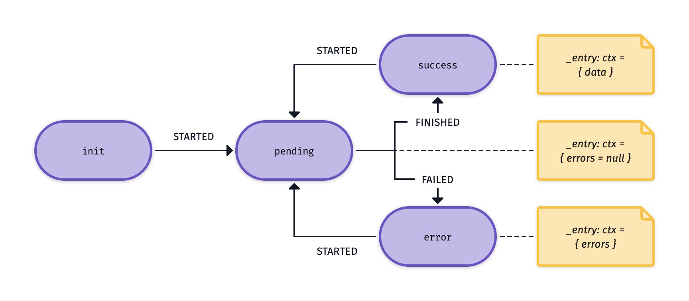
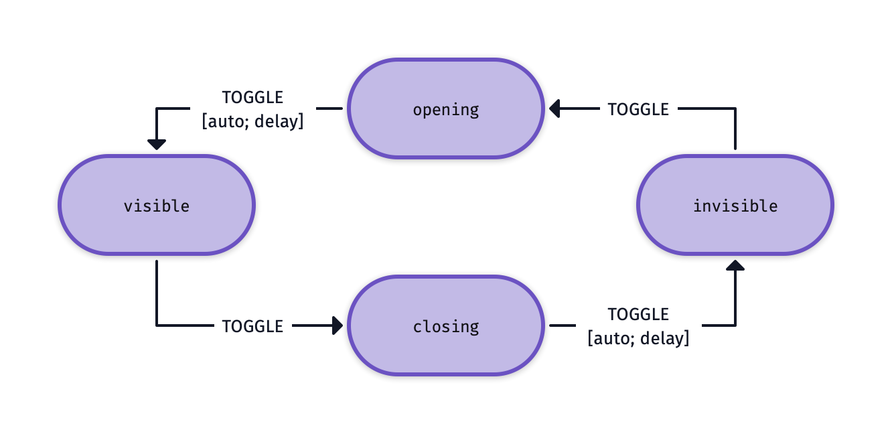
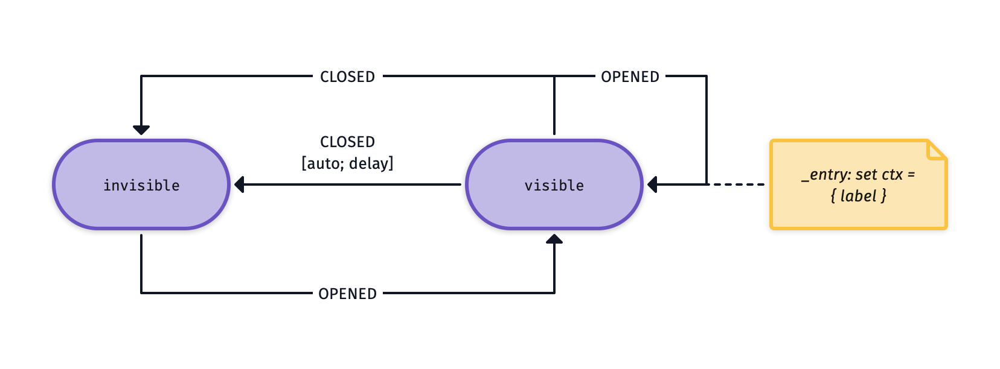
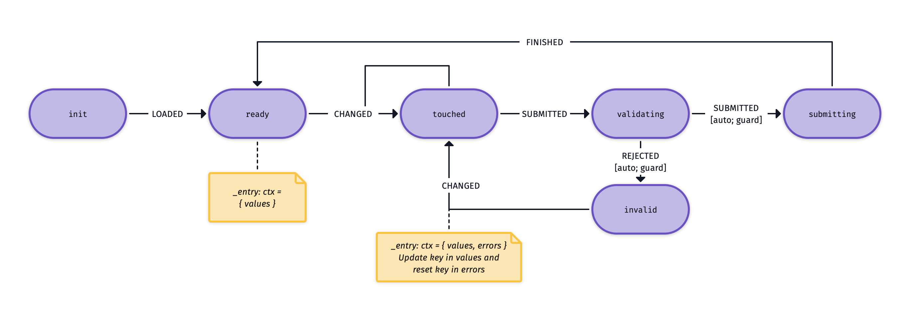

# Examples

## Fetching data



```js
import { assign } from '@crinkles/fsm';

const config = {
  idle: { STARTED: 'pending' },
  pending: { FINISHED: 'success', FAILED: 'error' },
  success: {
    STARTED: 'pending',
    _entry: [(_s, ctx, values) => assign({ ...ctx, data: values })],
  },
  error: {
    STARTED: 'pending',
    _entry: [(_s, ctx, values) => assign({ ...ctx, errors: values })],
  },
};
```

## Offscreen UI elements



```js
import { send } from '@crinkles/fsm';

const toggling = (_s, ctx) => send('TOGGLE', ctx, 10);

const config = {
  visible: { TOGGLE: 'closing' },
  closing: { TOGGLE: 'invisible', _entry: [toggling] },
  invisible: { TOGGLE: 'opening' },
  opening: { TOGGLE: 'visible', _entry: [toggling] },
};
```

## Toasts



```js
import { assign, send } from '@crinkles/fsm';

function valueAssign(_s, ctx, values) {
  return assign({ ...ctx, ...values });
}

const config: Record<string, State<Context>> = {
  visible: {
    CLOSED: 'invisible',
    OPENED: 'visible',
    _entry: [valueAssign, (_s, ctx) => send('CLOSED', ctx, 10)],
  },
  invisible: { OPENED: 'visible' },
};
```

## Debouncing


```js
import { send } from '@crinkles/fsm';

const config = {
  init: { CHANGED: 'debouncing' },
  debouncing: {
    GO: 'executing',
    CHANGED: 'debouncing',
    _entry: [(_s: string, ctx: O) => send('GO', ctx, 10)],
  },
  executing: { FINISHED: 'init' },
};
```

## Forms



```js
import { send, assign } from '@crinkles/fsm';

function validator(ctx) {
  if (ctx.values.key === 'test') return {};
  return { key: 'required' };
}

function isValid(ctx) {
  const _res = validator(ctx);
  if (Object.keys(_res).length === 0) return true;
  return false;
}

function updateEntry(_s, ctx, values) {
  const _ctx = { ...ctx };
  const _values = values;
  _ctx.values[_values.key] = _values.value;
  _ctx.errors[_values.key] = '';
  return assign(_ctx);
}

function validationAction(_s, ctx) {
  if (isValid(ctx)) return send('SUBMITTED');
        else return send('REJECTED', validator(ctx));
}

const config = {
  init: { LOADED: 'ready' },
  ready: {
    CHANGED: 'touched',
    _entry: [(_s, _ctx, values) => assign({ values: values, errors: {} })],
  },
  touched: {
    CHANGED: 'touched',
    SUBMITTED: 'validating',
    _entry: [updateEntry],
  },
  validating: {
    SUBMITTED: { target: 'submitting', guard: isValid },
    REJECTED: { target: 'invalid', guard: (ctx) => !isValid(ctx) },
    _entry: [validationAction],
  },
  invalid: {
    CHANGED: 'touched',
    _entry: [
      (_s, ctx, values) => assign({ ...ctx, errors: values as O }),
    ],
  },
  submitting: { FINISHED: 'ready' },
};
```

## Object state

## Authentication
