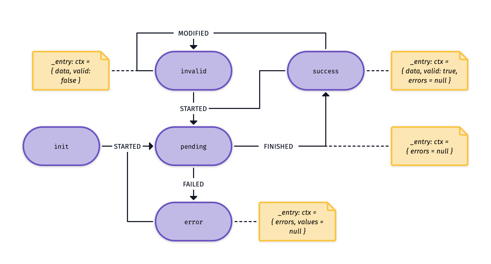
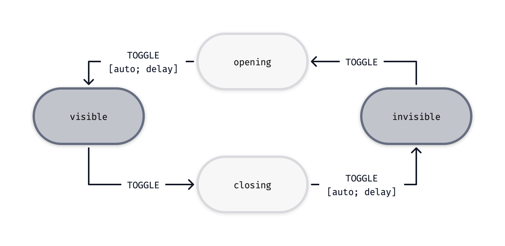
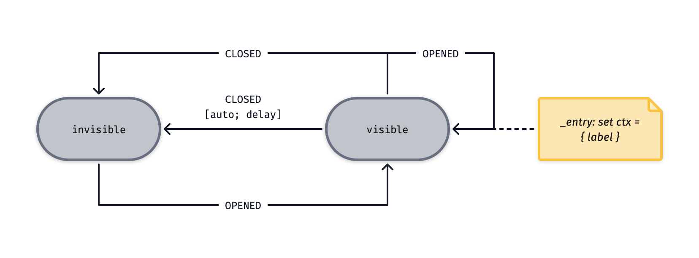
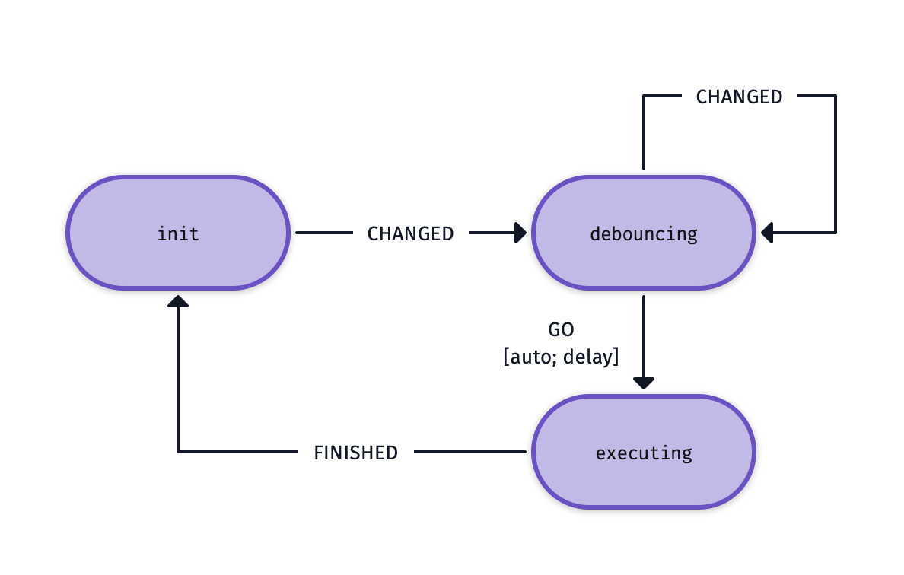
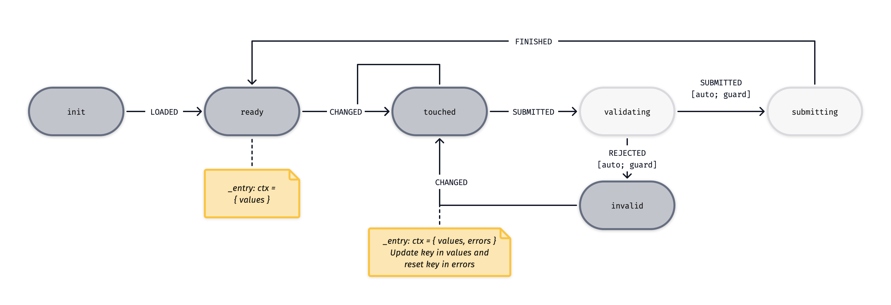
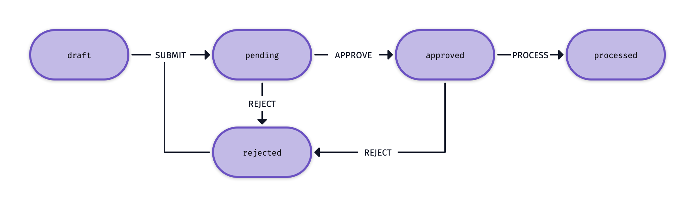
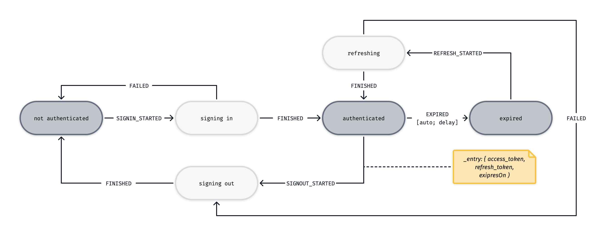

# Examples

Every example below has a runnable, typed counterpart in [tests/examples](../tests/examples).

## Fetching data



This state machine maintains the state of a single fetch operation (e.g. GET/POST). The context holds the data or errors of the response and can be rendered directly. Combined with a cache, where each url is a key and the corresponding machine the value, the `MODIFIED` event flags the cached entry as `invalid` and enables correct refresh strategies.

```js
// ACTIONS
const successEntry = ({ state, event, assign }) =>
  assign({ ...state.context, data: event.data, errors: null, valid: true });

const errorEntry = ({ state, event, assign }) =>
  assign({ ...state.context, errors: event.errors, data: null, valid: false });

const pendingEntry = ({ state, assign }) =>
  assign({ ...state.context, errors: null });

const invalidEntry = ({ state, event, assign }) =>
  assign({
    ...state.context,
    data: { ...state.context.data, [event.key]: event.value },
    valid: false,
  });

// MACHINE
const fetcher = machine({
  init: 'idle',
  context: { data: null, errors: null, valid: false },
  states: {
    idle: { STARTED: 'pending' },
    pending: { FINISHED: 'success', FAILED: 'error', _entry: [pendingEntry] },
    success: { STARTED: 'pending', MODIFIED: 'invalid', _entry: [successEntry] },
    invalid: { MODIFIED: 'invalid', _entry: [invalidEntry] },
    error: { STARTED: 'pending', _entry: [errorEntry] },
  },
});

// USAGE
fetcher.send({ type: 'STARTED' });
fetcher.send({ type: 'FINISHED', data });
fetcher.send({ type: 'FAILED', errors });
fetcher.send({ type: 'MODIFIED', key: 'test', value: 'test' });
```

## Offscreen UI elements



Think of modals, sidebars, etc. that appear and disappear on the screen. This machine has transitional states in which animations can happen; the `toggling` action moves on once the animation duration has passed.

```js
const toggling = ({ send }) => send({ type: 'TOGGLE' }, 300);

const panel = machine({
  init: 'invisible',
  states: {
    visible: { TOGGLE: 'closing' },
    closing: { TOGGLE: 'invisible', _entry: [toggling] },
    invisible: { TOGGLE: 'opening' },
    opening: { TOGGLE: 'visible', _entry: [toggling] },
  },
});
```

## Toasts



Toast messages are a special kind of offscreen UI element. Once shown they disappear automatically, unless they are triggered again, and they can be closed manually. Each `OPENED` re-enters `visible`, which cancels the pending `CLOSED` and schedules a new one.

```js
const toast = machine({
  init: 'invisible',
  context: { label: '' },
  states: {
    visible: {
      CLOSED: 'invisible',
      OPENED: 'visible',
      _entry: [
        ({ event, assign }) => assign({ label: event.label }),
        ({ send }) => send({ type: 'CLOSED' }, 6000),
      ],
    },
    invisible: { OPENED: 'visible' },
  },
});

toast.send({ type: 'OPENED', label: 'my toast message' });
```

## Debounce



Every `CHANGED` re-enters `debouncing` and cancels the pending `GO`. Only when no change arrives within the delay does the machine move to `executing`.

```js
const debounce = machine({
  init: 'idle',
  states: {
    idle: { CHANGED: 'debouncing' },
    debouncing: {
      CHANGED: 'debouncing',
      GO: 'executing',
      _entry: [({ send }) => send({ type: 'GO' }, 300)],
    },
    executing: { FINISHED: 'idle' },
  },
});
```

## Forms



```js
// ACTIONS
function validate(values) {
  if (values.key === 'test') return {};
  return { key: 'required' };
}

function isValid({ context }) {
  return Object.keys(validate(context.values)).length === 0;
}

const load = ({ event, assign }) => assign({ values: event.values, errors: {} });

const update = ({ state, event, assign }) =>
  assign({
    values: { ...state.context.values, [event.key]: event.value },
    errors: { ...state.context.errors, [event.key]: '' },
  });

const validation = ({ state, send }) => {
  if (isValid(state)) send({ type: 'SUBMITTED' });
  else send({ type: 'REJECTED', errors: validate(state.context.values) });
};

const reject = ({ state, event, assign }) =>
  assign({ ...state.context, errors: event.errors });

// MACHINE
const form = machine({
  init: 'init',
  context: { values: {}, errors: {} },
  states: {
    init: { LOADED: 'ready' },
    ready: { CHANGED: 'touched', _entry: [load] },
    touched: { CHANGED: 'touched', SUBMITTED: 'validating', _entry: [update] },
    validating: {
      SUBMITTED: { target: 'submitting', guard: isValid },
      REJECTED: 'invalid',
      _entry: [validation],
    },
    invalid: { CHANGED: 'touched', _entry: [reject] },
    submitting: { FINISHED: 'ready' },
  },
});

// USAGE
form.send({ type: 'LOADED', values: { key: '' } });
form.send({ type: 'CHANGED', key: 'key', value: 'test' });
form.send({ type: 'SUBMITTED' });
```

## Object state



By modelling the state of an object, the client can disallow features or rendering based on it, and apply optimistic UI according to the transitions the machine allows.

```js
const document = machine({
  init: 'draft',
  states: {
    draft: { SUBMIT: 'pending' },
    pending: { APPROVE: 'approved', REJECT: 'rejected' },
    approved: { REJECT: 'rejected', PROCESS: 'processed' },
    rejected: { SUBMIT: 'pending' },
    processed: {},
  },
});

function approve() {
  if (document.current !== 'pending') return;
  // ...
}
```

## Authentication



Token-based authentication has several steps and paths that map well onto a state machine. The machine can guard routes and rendering, and trigger the right side-effects (e.g. tell the server to terminate a session on sign-out).

```js
const auth = machine({
  init: 'not_authenticated',
  states: {
    not_authenticated: { SIGNIN_STARTED: 'signing_in' },
    signing_in: { FINISHED: 'authenticated', FAILED: 'not_authenticated' },
    authenticated: {
      SIGNOUT_STARTED: 'signing_out',
      EXPIRED: 'expired',
      _entry: [({ send }) => send({ type: 'EXPIRED' }, 90000)],
    },
    expired: { REFRESH_STARTED: 'refreshing' },
    signing_out: { FINISHED: 'not_authenticated' },
    refreshing: { FINISHED: 'authenticated', FAILED: 'signing_out' },
  },
});
```
